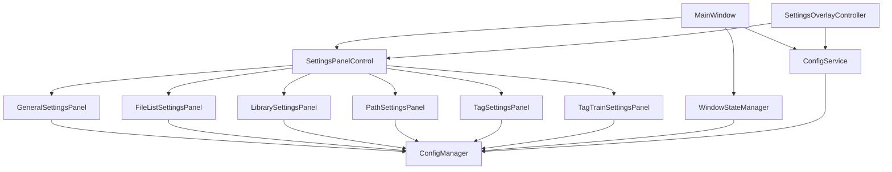
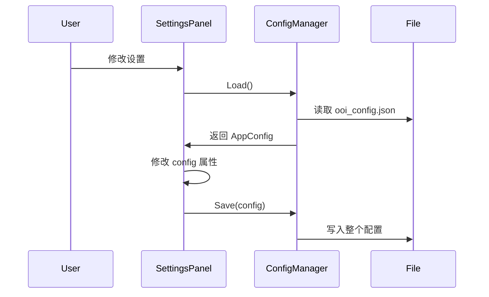

# OoiMRR 设置系统架构分析

## 执行摘要

本文档分析了OoiMRR应用程序中设置面板、状态管理和配置保存的完整架构，识别了当前系统的问题，并提供了未来改进的建议。

**关键发现：**
- 配置保存职责分散在多个组件中
- 缺乏统一的配置更新协调机制
- 多次完整配置保存导致覆盖问题
- 设置面板实时保存与关闭时保存存在冲突

---

## 1. 架构概览

### 1.1 核心组件



### 1.2 数据流向



---

## 2. 组件详细分析

### 2.1 ConfigManager (静态类)
**文件：** [`ConfigManager.cs`](file:///f:/Download/GitHub/OoiMRR/Services/Core/ConfigManager.cs)

**职责：**
- 配置文件的读写（JSON序列化/反序列化）
- 配置文件路径管理
- 配置导入/导出功能
- 配置迁移（向后兼容）

**关键方法：**
- `Load()` → `AppConfig` - 从磁盘加载配置
- `Save(AppConfig)` - 将整个AppConfig对象保存到磁盘
- `GetConfigFilePath()` - 返回 `AppData/ooi_config.json`

**问题：**
- ⚠️ `Save()` 方法保存**整个**`AppConfig`对象，可能覆盖其他地方修改的值
- ⚠️ 没有部分更新机制
- ⚠️ 并发保存时可能出现竞争条件

---

### 2.2 AppConfig (数据类)
**文件：** [`ConfigManager.cs`](file:///f:/Download/GitHub/OoiMRR/Services/Core/ConfigManager.cs#L10-L75)

**职责：**
- 存储所有应用配置数据

**配置分类：**

| 类别 | 示例属性 | 管理组件 |
|------|----------|----------|
| 窗口状态 | `WindowWidth`, `WindowHeight`, `IsMaximized` | WindowStateManager |
| 布局 | `ColLeftWidth`, `ColCenterWidth`, `ColRightWidth` | WindowStateManager |
| 列宽 | `ColNameWidth`, `ColTagsWidth`, `ColNotesWidth` | FileListSettingsPanel, ColumnService |
| 导航 | `LastPath`, `LastLibraryId` | NavigationStateManager |
| 标签页 | `OpenTabs`, `ActiveTabKey` | WindowStateManager |
| UI设置 | `ActionButtons`, `DarkMode` | GeneralSettingsPanel |
| 其他 | `SortColumn`, `ColumnOrder` | ColumnService |

**问题：**
- ⚠️ 单一配置对象被多个组件同时修改
- ⚠️ 缺乏配置项的所有权定义
- ⚠️ 没有版本控制或冲突检测

---

### 2.3 SettingsPanelControl
**文件：** [`SettingsPanelControl.xaml.cs`](file:///f:/Download/GitHub/OoiMRR/Controls/SettingsPanelControl.xaml.cs)

**职责：**
- 设置UI的容器和路由器
- 管理设置分类切换
- 协调设置面板的生命周期

**关键方法：**
- `LoadCategory(string)` - 创建并加载对应的设置面板
- `SaveAllSettings()` - 调用当前面板的 `SaveSettings()`
- `LoadAllSettings()` - 调用当前面板的 `LoadSettings()`

**问题：**
- ⚠️ 每次切换分类都创建新的面板实例（无状态缓存）
- ⚠️ `LoadCategory` 会调用 `LoadSettings()`，可能触发不必要的磁盘读取
- ⚠️ 事件订阅管理较复杂

---

### 2.4 ISettingsPanel 接口

**定义：**
```csharp
public interface ISettingsPanel
{
    void SaveSettings();
    void LoadSettings();
    event EventHandler SettingsChanged;
}
```

**实现类：**
- `GeneralSettingsPanel` - 通用设置（UI、按钮）
- `FileListSettingsPanel` - 文件列表列宽设置
- `LibrarySettingsPanel` - 库设置
- `PathSettingsPanel` - 路径设置
- `TagSettingsPanel` - 标签设置
- `TagTrainSettingsPanel` - TagTrain设置

**当前实现模式：**
各个设置面板的 `SaveSettings()` 和实时保存方法都调用：
```csharp
var config = ConfigManager.Load();
config.SomeProperty = newValue;
ConfigManager.Save(config);
```

**问题：**
- ❌ **致命缺陷**：每个面板保存时都覆盖整个配置文件
- ❌ Load-Modify-Save 模式在并发场景下不安全
- ❌ 没有协调机制防止互相覆盖

---

### 2.5 SettingsOverlayController
**文件：** [`SettingsOverlayController.cs`](file:///f:/Download/GitHub/OoiMRR/Services/UI/Settings/SettingsOverlayController.cs)

**职责：**
- 控制设置面板的显示/隐藏
- 协调设置应用流程

**关键方法：**
- `Show()` - 显示设置，调用 `LoadAllSettings()`
- `Hide` - 隐藏设置，~~调用 `SaveAllSettings()`~~（已移除）

**最近修改：**
- ✅ 注释掉 `Hide()` 中的 `SaveAllSettings()` 调用，避免覆盖问题

---

### 2.6 WindowStateManager
**文件：** [`WindowStateManager.cs`](file:///f:/Download/GitHub/OoiMRR/Services/UI/WindowStateManager.cs)

**职责：**
- 保存/恢复窗口大小、位置、最大化状态
- 保存/恢复分割线位置（三列布局）
- 保存/恢复导航状态
- 保存/恢复标签页状态

**关键方法：**
- `SaveAllState()` - 保存所有UI状态
- `SaveWindowState()` - 保存窗口状态
- `SaveSplitterPositions()` - 保存分割线位置
- `SaveNavigationState()` - 保存导航状态
- `SaveTabsState()` - 保存标签页状态

**调用时机：**
- 窗口调整大小后
- 拖动分割线后
- 切换导航位置后
- 打开/关闭标签页后
- 程序关闭时（`WindowLifecycleHandler.HandleClosing()`）

**问题：**
- ⚠️ 与设置面板共享 `AppConfig` 对象
- ⚠️ 频繁调用 `ConfigManager.Save()` 可能影响性能

---

### 2.7 ConfigService
**文件：** [`ConfigService.cs`](file:///f:/Download/GitHub/OoiMRR/Services/Core/Config/ConfigService.cs)

**职责：**
- 应用配置到UI（启动时）
- 提供延迟保存机制（防抖动）
- 保存当前配置

**关键方法：**
- `ApplyConfig()` - 将配置应用到窗口
- `SaveCurrentConfig()` - 保存当前状态到配置
- `StartDelayedSave()` - 300ms防抖保存

**问题：**
- ⚠️ `SaveCurrentConfig()` 也调用 `ConfigManager.Save()`
- ⚠️ 注释说明"列宽由 WindowStateManager 管理，这里不保存"，但实际仍可能冲突

---

### 2.8 ColumnService
**文件：** [`ColumnService.cs`](file:///f:/Download/GitHub/OoiMRR/Services/UI/ColumnManagement/ColumnService.cs)

**职责：**
- 管理文件列表的列宽度
- 管理列顺序和可见性
- 保存列配置

**关键方法：**
- `SaveColumnWidths(FileBrowserControl)` - 保存列宽度到配置
- `RememberColumnWidth(string, GridViewColumn)` - 记住单列宽度

**最近修改：**
- ✅ Tags 和 Notes 列的宽度不再保存（注释掉）

---

## 3. 现有问题总结

### 3.1 配置冲突问题

**问题描述：**
多个组件同时修改并保存整个`AppConfig`对象，导致后保存的覆盖先保存的。

**示例场景：**
```
1. 用户在 FileListSettingsPanel 修改 ColNotesWidth=300
   → ConfigManager.Save(config) → 写入磁盘 ✅
   
2. 用户切换到 GeneralSettingsPanel

3. 用户关闭设置
   → SettingsOverlayController.Hide()
   → SaveAllSettings()
   → GeneralSettingsPanel.SaveSettings()
   → ConfigManager.Load() → config.ColNotesWidth=115 (旧值)
   → ConfigManager.Save(config) → 覆盖！❌
```

**根本原因：**
- Load-Modify-Save 模式不支持并发修改
- 没有配置更新协调机制
- `ConfigManager.Save()` 保存整个对象而非部分更新

### 3.2 职责不清

| 配置项 | 应管理者 | 实际管理者 |
|--------|----------|------------|
| `ColNotesWidth` | FileListSettingsPanel | FileListSettingsPanel, ColumnService |
| `WindowWidth` | WindowStateManager | WindowStateManager, ConfigService |
| `OpenTabs` | WindowStateManager | WindowStateManager |

### 3.3 性能问题

**频繁保存：**
- 每次拖动分割线都保存配置
- 每次修改设置都立即保存
- 没有统一的防抖机制

**不必要的磁盘I/O：**
- 切换设置面板时重新加载配置
- 多个组件反复 `Load()` 同一配置

### 3.4 扩展性差

**添加新设置面板的问题：**
- 必须理解所有现有组件的保存逻辑
- 需要避开已被占用的配置项
- 缺乏文档说明配置项所有权

---

## 4. 推荐架构改进

### 4.1 配置管理重构方案

#### 方案A：单一配置管理器（推荐）

**核心思想：**
- 创建`ConfigurationManager`单例，统一管理所有配置读写
- 不再直接调用`ConfigManager.Save()`，而是通过`ConfigurationManager.UpdateConfig(action)`
- 内置防抖和冲突检测

**实现示例：**
```csharp
public class ConfigurationManager
{
    private static ConfigurationManager _instance;
    private AppConfig _config;
    private readonly object _lock = new object();
    private DispatcherTimer _saveTimer;
    
    public static ConfigurationManager Instance => _instance ??= new ConfigurationManager();
    
    private ConfigurationManager()
    {
        _config = ConfigManager.Load();
        InitializeSaveTimer();
    }
    
    /// <summary>
    /// 更新配置（线程安全）
    /// </summary>
    public void UpdateConfig(Action<AppConfig> updateAction)
    {
        lock (_lock)
        {
            updateAction(_config);
            ScheduleSave();
        }
    }
    
    /// <summary>
    /// 获取配置副本（只读）
    /// </summary>
    public AppConfig GetConfig()
    {
        lock (_lock)
        {
            // 返回深拷贝，防止外部修改
            return CloneConfig(_config);
        }
    }
    
    private void ScheduleSave()
    {
        _saveTimer.Stop();
        _saveTimer.Start();
    }
    
    private void SaveTimer_Tick(object sender, EventArgs e)
    {
        _saveTimer.Stop();
        lock (_lock)
        {
            ConfigManager.Save(_config);
        }
    }
}
```

**使用示例：**
```csharp
// FileListSettingsPanel
ConfigurationManager.Instance.UpdateConfig(config =>
{
    config.ColNotesWidth = 300;
});

// WindowStateManager
ConfigurationManager.Instance.UpdateConfig(config =>
{
    config.WindowWidth = window.Width;
    config.WindowHeight = window.Height;
});
```

**优点：**
- ✅ 统一的配置更新入口
- ✅ 内置防抖机制（300ms）
- ✅ 线程安全
- ✅ 避免Load-Modify-Save冲突

**缺点：**
- ❗ 需要重构所有现有调用点

---

#### 方案B：配置分区（中等改动）

**核心思想：**
- 将`AppConfig`拆分为多个配置类
- 每个组件只管理自己的配置分区
- 使用独立文件存储

**实现示例：**
```csharp
// 窗口配置
public class WindowConfig
{
    public double WindowWidth { get; set; }
    public double WindowHeight { get; set; }
    public bool IsMaximized { get; set; }
}

// 列配置
public class ColumnConfig
{
    public double ColTagsWidth { get; set; }
    public double ColNotesWidth { get; set; }
    public string ColumnOrder { get; set; }
}

// 分区管理器
public class ConfigPartitionManager
{
    public static void SaveWindowConfig(WindowConfig config)
    {
        var json = JsonSerializer.Serialize(config);
        File.WriteAllText("AppData/window_config.json", json);
    }
    
    public static WindowConfig LoadWindowConfig()
    {
        // ...
    }
}
```

**优点：**
- ✅ 配置分离，减少冲突
- ✅ 更清晰的职责划分

**缺点：**
- ❗ 配置文件变多
- ❗ 导入/导出功能需要更新
- ❗ 仍需重构大部分代码

---

#### 方案C：最小改动方案（当前采用）

**已实现的修复：**
1. ✅ 移除 `SettingsOverlayController.Hide()` 中的 `SaveAllSettings()`
2. ✅ `ColumnService` 不再保存 Tags/Notes 列宽度
3. ✅ 设置面板实时保存（LostFocus），不在关闭时保存

**仍需改进：**
- ⚠️ 添加配置项所有权文档
- ⚠️ 在`AppConfig`类中添加注释说明每个属性的管理者

---

### 4.2 设置面板扩展模式

**标准设置面板实现模板：**

```csharp
public partial class NewSettingsPanel : UserControl, ISettingsPanel
{
    private bool _isLoadingSettings;
    
    public event EventHandler SettingsChanged;
    
    public NewSettingsPanel()
    {
        InitializeComponent();
        // 不在构造函数中调用 LoadSettings()
    }
    
    public void LoadSettings()
    {
        _isLoadingSettings = true;
        try
        {
            var config = ConfigManager.Load();
            // 填充UI控件
            MyTextBox.Text = config.MySetting.ToString();
        }
        finally
        {
            _isLoadingSettings = false;
        }
    }
    
    public void SaveSettings()
    {
        // 当前方案：不实现此方法
        // 使用实时保存代替
    }
    
    private void MyTextBox_LostFocus(object sender, RoutedEventArgs e)
    {
        if (_isLoadingSettings) return;
        
        if (int.TryParse(MyTextBox.Text, out int value))
        {
            ApplyMySetting(value);
        }
    }
    
    private void ApplyMySetting(int value)
    {
        var config = ConfigManager.Load();
        config.MySetting = value;
        ConfigManager.Save(config);
        
        SettingsChanged?.Invoke(this, EventArgs.Empty);
    }
}
```

**最佳实践：**
1. **实时保存**：在 LostFocus 或值改变时立即保存
2. **不在构造函数中加载**：由 `SettingsPanelControl.LoadCategory()` 调用
3. **标志位防止递归**：`_isLoadingSettings` 避免加载时触发保存
4. **触发事件通知**：`SettingsChanged` 让其他组件响应
5. **配置项文档**：在代码注释说明管理哪些配置项

---

### 4.3 未来扩展计划

#### 4.3.1 配置项所有权文档

在 `AppConfig` 类中添加注释：

```csharp
public class AppConfig
{
    // === 窗口状态 (WindowStateManager) ===
    public double WindowWidth { get; set; } = 1200;
    public double WindowHeight { get; set; } = 800;
    public bool IsMaximized { get; set; } = false;
    
    // === 布局 (WindowStateManager) ===
    public double ColLeftWidth { get; set; } = 300;
    public double ColCenterWidth { get; set; } = 850;
    
    // === 文件列表列宽 (FileListSettingsPanel) ===
    /// <summary>
    /// 标签列宽度
    /// 管理者: FileListSettingsPanel
    /// 不要在其他地方修改！
    /// </summary>
    public double ColTagsWidth { get; set; } = 150;
    
    /// <summary>
    /// 备注列宽度
    /// 管理者: FileListSettingsPanel
    /// 不要在其他地方修改！
    /// </summary>
    public double ColNotesWidth { get; set; } = 200;
    
    // ...
}
```

#### 4.3.2 配置验证

添加配置验证层：

```csharp
public class ConfigValidator
{
    public static bool Validate(AppConfig config, out List<string> errors)
    {
        errors = new List<string>();
        
        if (config.ColTagsWidth < 50 || config.ColTagsWidth > 800)
            errors.Add("ColTagsWidth must be between 50 and 800");
            
        if (config.WindowWidth < 800)
            errors.Add("WindowWidth must be at least 800");
            
        return errors.Count == 0;
    }
}
```

#### 4.3.3 配置变更监听

```csharp
public class ConfigChangeNotifier
{
    public event EventHandler<ConfigChangedEventArgs> ConfigChanged;
    
    public void NotifyChange(string propertyName, object oldValue, object newValue)
    {
        ConfigChanged?.Invoke(this, new ConfigChangedEventArgs
        {
            PropertyName = propertyName,
            OldValue = oldValue,
            NewValue = newValue
        });
    }
}
```

---

## 5. 迁移路线图

### 阶段1：文档和规范（1周）
- [ ] 完成配置项所有权文档
- [ ] 编写设置面板开发指南
- [ ] 代码审查现有设置面板

### 阶段2：核心重构（2-3周）
- [ ] 实现 `ConfigurationManager` 单例
- [ ] 重构 `FileListSettingsPanel` 使用新API
- [ ] 重构 `WindowStateManager` 使用新API
- [ ] 添加单元测试

### 阶段3：全面迁移（2周）
- [ ] 迁移所有设置面板
- [ ] 迁移 `ConfigService`
- [ ] 迁移 `ColumnService`
- [ ] 集成测试

### 阶段4：优化和清理（1周）
- [ ] 移除旧的 `ConfigManager.Save()` 直接调用
- [ ] 性能优化
- [ ] 文档更新

---

## 6. 关键决策记录

### 决策1：为什么移除 SaveAllSettings()？
**日期：** 2025-12-23

**问题：** 关闭设置时调用 `SaveAllSettings()` 导致当前面板覆盖其他面板的配置

**决策：** 移除 `SettingsOverlayController.Hide()` 中的调用

**理由：**
- 各设置面板已实现实时保存
- 关闭时保存是冗余的
- 避免Load-Modify-Save冲突

**影响：**
- ✅ 解决了 Notes 列宽度重启后恢复的问题
- ⚠️ 需要确保所有面板都实现了实时保存

---

### 决策2：列宽度由谁管理？
**日期：** 2025-12-23

**决策：** Tags 和 Notes 列宽度专由 `FileListSettingsPanel` 管理

**实现：**
- `ColumnService.SaveColumnWidths()` 跳过 Tags/Notes
- `ColumnService.RememberColumnWidth()` 跳过 Tags/Notes
- `FileListSettingsPanel.ApplyNotesWidth()` 负责保存

**理由：**
- 设置面板是用户显式修改的地方
- `ColumnService` 的保存是隐式的（拖拽列标题）
- 显式意图应优先于隐式行为

---

## 7. 附录

### 附录A：配置文件结构

**文件：** `AppData/ooi_config.json`

```json
{
  "WindowWidth": 1200,
  "WindowHeight": 800,
  "IsMaximized": true,
  "ColLeftWidth": 300,
  "ColCenterWidth": 850,
  "ColRightWidth": 720,
  "ColNameWidth": 200,
  "ColSizeWidth": 100,
  "ColTypeWidth": 100,
  "ColModifiedDateWidth": 150,
  "ColCreatedTimeWidth": 50,
  "ColTagsWidth": 150,
  "ColNotesWidth": 200,
  "ColumnOrder": "Name,Size,Type,ModifiedDate,CreatedTime,Tags,Notes",
  "VisibleColumns_Path": "Name,Size,Type,ModifiedDate,Tags,Notes",
  "VisibleColumns_Library": "Name,Size,Type,ModifiedDate,Tags,Notes",
  "VisibleColumns_Tag": "Name,Size,Type,ModifiedDate",
  "SortColumn": "Name",
  "SortDirection": "Ascending",
  "LastPath": "C:\\Users\\...",
  "LastLibraryId": 1,
  "OpenTabs": ["path:C:\\...", "library:1", "tag:曜华"],
  "ActiveTabKey": "path:C:\\...",
  "DarkMode": false,
  "ActionButtons": ["home", "back", "forward"]
}
```

### 附录B：相关文件清单

#### 设置面板
- [`Controls/SettingsPanelControl.xaml.cs`](file:///f:/Download/GitHub/OoiMRR/Controls/SettingsPanelControl.xaml.cs) - 设置UI容器
- [`Controls/Settings/GeneralSettingsPanel.xaml.cs`](file:///f:/Download/GitHub/OoiMRR/Controls/Settings/GeneralSettingsPanel.xaml.cs)
- [`Controls/Settings/FileListSettingsPanel.xaml.cs`](file:///f:/Download/GitHub/OoiMRR/Controls/Settings/FileListSettingsPanel.xaml.cs)
- [`Controls/Settings/LibrarySettingsPanel.xaml.cs`](file:///f:/Download/GitHub/OoiMRR/Controls/Settings/LibrarySettingsPanel.xaml.cs)
- [`Controls/Settings/PathSettingsPanel.xaml.cs`](file:///f:/Download/GitHub/OoiMRR/Controls/Settings/PathSettingsPanel.xaml.cs)
- [`Controls/Settings/TagSettingsPanel.xaml.cs`](file:///f:/Download/GitHub/OoiMRR/Controls/Settings/TagSettingsPanel.xaml.cs)
- [`Controls/Settings/TagTrainSettingsPanel.xaml.cs`](file:///f:/Download/GitHub/OoiMRR/Controls/Settings/TagTrainSettingsPanel.xaml.cs)

#### 配置管理
- [`Services/Core/ConfigManager.cs`](file:///f:/Download/GitHub/OoiMRR/Services/Core/ConfigManager.cs) - 配置文件I/O
- [`Services/Core/Config/ConfigService.cs`](file:///f:/Download/GitHub/OoiMRR/Services/Core/Config/ConfigService.cs) - 配置应用服务

#### 状态管理
- [`Services/UI/WindowStateManager.cs`](file:///f:/Download/GitHub/OoiMRR/Services/UI/WindowStateManager.cs) - 窗口状态
- [`Services/UI/NavigationStateManager.cs`](file:///f:/Download/GitHub/OoiMRR/Services/UI/NavigationStateManager.cs) - 导航状态

#### 其他
- [`Services/UI/Settings/SettingsOverlayController.cs`](file:///f:/Download/GitHub/OoiMRR/Services/UI/Settings/SettingsOverlayController.cs) - 设置显示控制
- [`Services/UI/ColumnManagement/ColumnService.cs`](file:///f:/Download/GitHub/OoiMRR/Services/UI/ColumnManagement/ColumnService.cs) - 列管理
- [`Handlers/WindowLifecycleHandler.cs`](file:///f:/Download/GitHub/OoiMRR/Handlers/WindowLifecycleHandler.cs) - 窗口生命周期

---

## 8. 总结

当前的设置系统功能完整，但存在配置冲突的系统性问题。通过移除冗余的保存调用和明确职责分工，我们已经修复了最紧急的问题。

**下一步建议：**
1. 📝 添加配置项所有权文档（高优先级）
2. 🏗️ 实现 `ConfigurationManager` 统一配置管理（中期目标）
3. ✅ 为所有设置面板添加单元测试（长期目标）

**维护建议：**
- 新增设置时，先在 `AppConfig` 中注释声明所有权
- 使用实时保存模式，避免在 `SaveSettings()` 中保存
- 定期审查配置保存调用点，确保不会互相冲突
