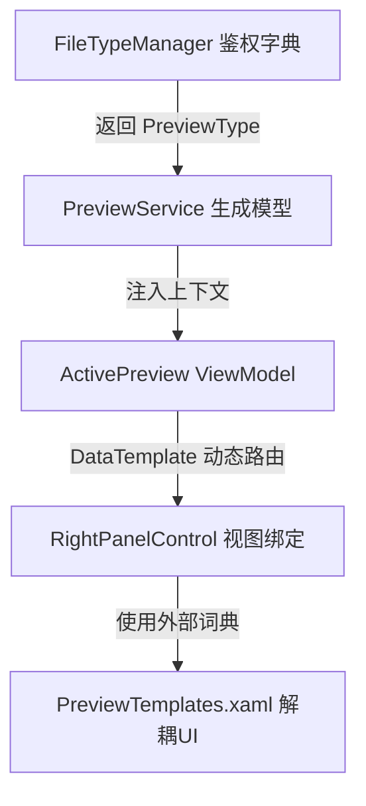

# YiboFile 预览格式支持文档及战略规划

**更新日期：** 2026-03-01  
**文档状态：** 正式版 / MVVM重构后
**归属域：** YiboFile-Core, YiboFile-Pro 

---

## 目录

1. [概述](#概述)
2. [底层架构变更说明](#底层架构变更说明)
3. [基础版 (Core) 支持的格式分类](#基础版-core-支持的格式分类)
4. [商业版 (Pro/Ultra) 格式扩展规划](#商业版-proultra-格式扩展规划)
5. [技术限制与性能评估](#技术限制与性能评估)

---

## 概述

YiboFile (原OoiMRR) 提供了强大的内置文件预览功能。经过架构重构与洗牌，当前系统已经完整迁移到 MVVM 架构，不再依赖繁琐的后台手动 UI 构建。本文档梳理了当前在开源核心版 (Core) 中已经支持的格式，并明确了未来需要移入商业加强版 (Pro/Ultra) 的高阶格式支持策略。

---

## 底层架构变更说明

过去的架构依赖于硬编码的 `IPreviewProvider` 以及 `PreviewHelper` 动态生成界面。
**当前架构（2026版）：**

---

## 基础版 (Core) 支持的格式分类

核心版旨在覆盖最常见且没有严苛授权限制、解析成本适中的大众化格式。

### 1. 媒体及图片文件 (Images) ✅
底层基于 `ImageMagick` 和原生 `WPF BitmapImage`。

| 格式 | 扩展名 | Core版支持状态 | 备注 |
|------|--------|---------|------|
| 常规光栅图 | `.jpg`, `.png`, `.gif`, `.bmp`, `.webp`, `.ico` | ✅ 完整支持 | 带有 `OptimizedGifPreview` 动画支持 |
| 高级/专业图 | `.tiff`, `.tga`, `.blp`, `.psd` | ✅ 基础支持 | PSD 仅显示合并后的导视图级结果 |
| 矢量图形 | `.svg` | ✅ 完整支持 |  |
| 苹果及特殊图 | `.heic`, `.heif`, `.ai` | ✅ 有限支持 | AI文件依赖内部嵌入流和 Magick 解析 |

### 2. 文本和代码文件 (Text/Code) ✅
底层基于 AvalonEdit。

| 类别 | 扩展名 | Core版支持状态 | 功能特性 |
|------|--------|---------|------|
| 纯文本与配置 | `.txt`, `.log`, `.md`, `.ini`, `.json`, `.xml`, `.yaml`, `.csv` 等 | ✅ 完整支持 | 支持自动切换编码，基于 CancellationToken 的线程安全读取，支持保存编辑。 |
| 网页与样式 | `.html`, `.css`, `.scss` | ✅ 完整支持 | 包含内嵌 Chromium (WebView2) 渲染预览。 |
| 高级及各类脚本 | `.cs`, `.py`, `.java`, `.ts`, `.sh`, `.ps1`, `.bat` 等过百种语言 | ✅ 完整支持 | 自动匹配 AvalonEdit 的高亮规则集。 |

### 3. 音视频媒体 (Audio/Video) 🎵🎬
底层基于 `LibVLCSharp` (VLC 媒体播放引擎)，抛弃了羸弱的原生 MediaElement。

| 类别 | 扩展名 | Core版支持状态 | 备注 |
|------|--------|---------|------|
| 主流视频 | `.mp4`, `.avi`, `.mkv`, `.mov`, `.flv`, `.webm` | ✅ 完整支持 | 带进度条、快进退和音量控制功能。 |
| 移动及老视频 | `.rm`, `.rmvb`, `.mpg`, `.m4v`, `.wmv` | ✅ 完整支持 | 传统格式一并接管。 |
| 不支持视频 | `.3gp`, `.vob`, `.asf` | ❌ 拦截 | 拦截以防止 VLC 解码异常奔溃。 |
| 常见音频 | `.mp3`, `.wav`, `.flac`, `.aac`, `.ogg`, `.m4a`, `.ape` 等 | ✅ 完整支持 | 显示基础媒体控制，隐藏视频区。 |

### 4. 办公文档 (Office/Document) 📄
基于 `WebView2` 和 `Aspose`/`OpenXML` 方案。

| 格式 | 扩展名 | Core版支持状态 | 功能特性 |
|------|--------|---------|------|
| PDF | `.pdf` | ✅ 完整支持 | 基于 PDF.js 提供翻页、缩放与查找。 |
| CHM | `.chm` | ✅ 完整支持 | 解压式内嵌目录阅读。 |
| 富文本 | `.rtf` | ✅ 完整支持 | RichTextBox 原生支持。 |
| Word | `.doc`, `.docx` | ✅ 支持 | 提供转 HTML 并在 WebView2 显示的体验。 |
| Excel | `.xls`, `.xlsx` | ✅ 支持 | DataGrid 数据表形态。 |
| PowerPoint | `.ppt`, `.pptx` | ✅ 支持 | 转换为 HTML/PDF 翻页浏览。 |
| CAD图纸 | `.dwg`, `.dxf` | ✅ 基础支持 | 需要转码，Core 提供底层二维有限预览。 |
| Apple iWork | `.pages`, `.numbers`, `.key` | ❌ 不支持 | 闭源格式需 Mac 环境支持。 |

### 5. 常见档案与程序包 (Archive) 📦
基于 `SharpCompress` 和 `System.IO.Compression`。

| 格式 | 扩展名 | Core版支持状态 | 备注 |
|------|--------|---------|------|
| 压缩包 | `.zip` | ✅ 完整支持 | 列出内置树形图、大小。 |
| Java集成包 | `.jar` | ✅ 完整支持 | 基于 Zip 标准。 |
| 安卓安装包 | `.apk` | ✅ 完整支持 | 作为压缩包解包查看 Manifest 等元数据。 |

---

## 商业版 (Pro/Ultra) 格式扩展规划

一些特殊授权格式、专业解析格式或非常吃性能的高级逆向需求，不应放在 Core 版。我们需要将其定义为 **YiboFile Pro** 或 **Ultra** 的专属付费卖点。

### 1. 高级密码学与专有压缩包解包 (Pro)
在 Core 版本，`.rar` 和 `.7z` 因为授权 (Unrar license) 和解压复杂度的原因被我们设置为 `CanPreview = false`。
* **规划**：在 Pro 版中集成商业版的 SevenZipSharp 和合规的提取器。
* **支持格式**：`.rar`, `.7z`, `.tar`, `.gz`, `.xz`, `.iso`, `.dmg`。

### 2. PE程序文件逆向基础预览 (Pro)
Core 版本完全拦截可执行文件与系统包。
* **规划**：在 Pro 版本增加针对 PE 结构的探针，显示数字签名证书、反编译版本号、引入导出的 DLL 函数依赖表。
* **支持格式**：`.exe`, `.dll`, `.sys`, `.msi`。

### 3. 高级工业 3D / CAD 渲染 (Ultra)
Core 版 CAD 提供的是基本的二维降级预览图。
* **规划**：Ultra 版接入 OpenGL/DirectX 在线渲染器或通过商业版的三方 CAD 集成引擎，提供任意旋转和 3D 工程图解析。
* **支持格式**：原生全规格 `.dwg`, `.max`, `.obj`, `.stl`, `.step`, `.fbx`。

### 4. 专业摄影摄像 RAW 格式数字冲印 (Pro)
这些格式提及巨大并且需要解析复杂的拜耳阵列传感器原始数据。
* **规划**：集成 LibRaw 或相关的 RAW 解析加速库提供 Pro 版色彩深度读取。
* **支持格式**：`.cr2`/`.cr3` (Canon), `.arw` (Sony), `.nef` (Nikon), `.dng`。

### 5. 高级字体元数据阅览器 (Pro)
* **规划**：超越传统的字形显示，支持直接分析 `.ttf`, `.otf` 的连字 (Ligatures)、字距调整 (Kerning) 甚至包含的字距全集库。

---

## 技术限制与性能评估

1. **大文件防爆池：** 对于文本 (Text) 大于 10MB、XML 大于 5MB 的，Core 版底层已经增加了异步 CancelationToken 和长度截断预警，确保软件不会因为高频次预览极大文本（如日志）引发 OOM (内存溢出) 或者假死。
2. **安全隔离：** WebView2 和 VLC 实例由于具有非托管特性，必须严格由 `ActivePreview` 中继承的 `IDisposable` 接口统筹销毁，已通过 `PreviewService` 重构确保无资源泄露风险。
3. **闭源协议风险：** Apple 的 `.pages` 及其它完全私有的企业格式，由于严重缺乏开放 SDK，未来在可预见的路线图中仍将被标注为 `CanPreview = false`。
